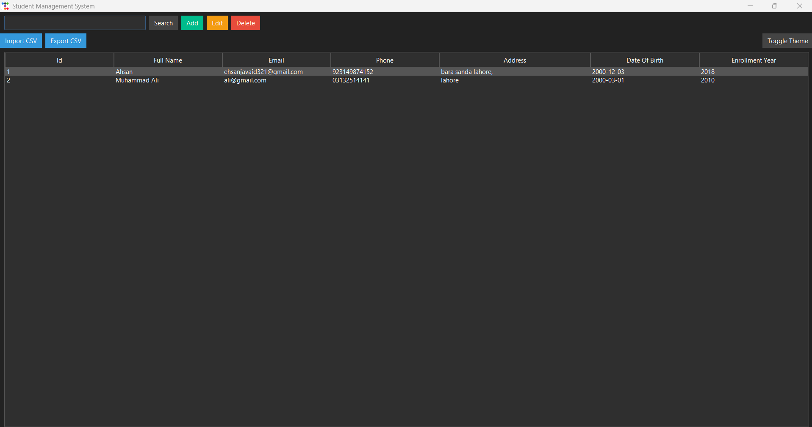

# Student Management System (Python + ttkbootstrap)

A modern desktop Student Management System built with Python, Tkinter, and ttkbootstrap. Data is stored locally in SQLite via SQLAlchemy. Includes CRUD operations, search/filter, CSV import/export, and a theme toggle.

## Features

- Create, Read, Update, Delete students
- Search by name or email
- CSV import and export
- Modern UI using ttkbootstrap themes (light/dark)
- Theme preference and window size persisted to `settings.json`

## Requirements

- Python 3.10+

## Image

## Setup (Windows PowerShell)

```powershell
py -m venv .venv
.\.venv\Scripts\Activate
pip install -r app/requirements.txt
python -m app
```

If `py` isn't available, use `python` instead.

## Project Structure

```
app/
├─ ui/
│  ├─ __init__.py
│  ├─ main_window.py
│  └─ student_form.py
├─ services/
│  ├─ __init__.py
│  └─ student_service.py
├─ __init__.py
├─ __main__.py
├─ main.py
├─ config.py
├─ database.py
├─ models.py
├─ requirements.txt
└─ README.md
```

The database file `student_mgmt.db` and `settings.json` are created in the parent directory of `app/` on first run.


